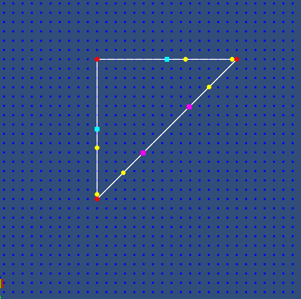

MultiAgentSimulation
====================

Technological demo of the technology used to create the Sim City 5 game (glassbox engine), based mostly on the GDC presentation given by Maxis.

The simulation engine is made in pure C#, available in "Assets\Scripts\MultiAgentSimulation", and the visualization is made in Unity.

Also contains a port to C# of the CSG (Constructive Solid Geometry) library developed by http://evanw.github.com/csg.js/ , available in "Assets\Scripts\CSG"

Screenshot:

Explanation:
- Red Circles: Path nodes
- White Lines: Path between nodes
- Magenta Square: House with people
- Cyan Square: Factory that accepts people
- Yellow Circle: People travelling from House to Factory
